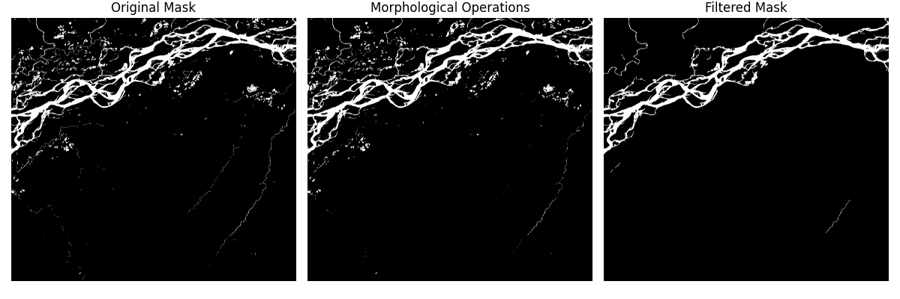

# mask2graph

**mask2graph** is a Python library for converting **binary segmentation masks** into **graph-based representations**.

The project focuses on extracting structured, topologically meaningful graphs from raster masks, enabling downstream analysis such as connectivity assessment, network statistics, and vector export.

This repository was initially created to support my thesis. Alongside this repository a secondary repository was made to support the riverseg project. It is focused on extracting river extents from satellite imagery using deep learning techniques. It can be found here: [riverseg](https://github.com/mort607e/riverseg)


## Test data
This repository was initially made for large river masks, these files are quite large and as a result are not included in the repo. However they can be downloaded from here: [https://drive.google.com/file/d/1abPzbC0Mhuj2_Ra5qz0ydEbuGbobuqFh/view?usp=sharing](https://drive.google.com/file/d/1abPzbC0Mhuj2_Ra5qz0ydEbuGbobuqFh/view?usp=sharing)\
This zip file contains 3 large river masks in tif format. Place them in `data/samples` after downloading and unzipping, to use them with the provided examples. 

## Mask cleaning and post-processing

Before converting a binary mask to a graph, it is often useful to apply **basic morphological cleaning** to remove noise and spurious components.
This repository includes simple utilities for cleaning binary masks using OpenCV-based operations:

- **Morphological opening** to remove small artifacts  
- **Morphological closing** to fill small gaps and smooth boundaries  
- **Connected component filtering** based on an *area-to-bounding-box ratio*, useful for removing thin or fragmented regions  

A typical workflow consists of:
1. Validating the mask as binary (`uint8`, values {0,1})
2. Applying morphological opening and closing
3. Filtering connected components by area ratio

### Example usage

```python
kernel = construct_kernel(cv2.MORPH_RECT, (5, 5))

binaryMaskCheck(mask)

morph_opened = morphological_opening(mask, kernel)
morph_closed = morphological_closening(morph_opened, kernel)

clean_mask = filter_components_by_area_ratio(
    morph_closed,
    max_area_ratio=0.15
)

filled_mask = fill_small_holes(filtered_mask, 250)
```

An example of the effect of these operations is shown below:



These utilities are intended as a **lightweight, explicit preprocessing step**
before skeletonization and graph extraction, and can be adapted or replaced
depending on the application domain.
